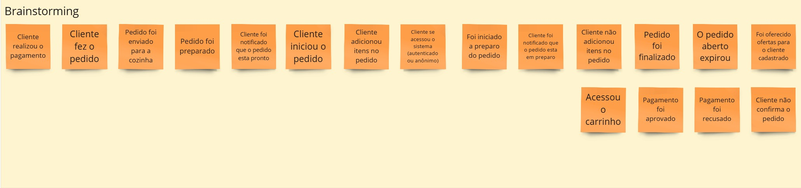

# Lanchonet40App by **_Grupo 40_**

Lanchonet40App é uma aplicação REST API desenvolvida como parte do tech challenge do curso de Software Architecture da Fiap. O projeto coloca em prática os conhecimentos adquiridos ao longo do curso.

O objetivo do desenvolvimento é apoiar uma lanchonete de bairro em rápida expansão, oferecendo uma solução para gerenciar pedidos e aumentar a satisfação dos clientes.


**Índice**

- [Propósito](#proposito)
- [Princípios](#principios)
- [Documentações](#documentacoes)
- [Linguagem Ubíqua](#Linguagem_Ubiqua)
- [Requisitos](#requisitos)
- [Estrutura](#estrutura)
- [Executando](#executando)
- [Endpoints](#endpoints)


## Propósito

Para garantir a satisfação dos clientes em um negócio em constante crescimento, foi modelada uma solução que auxilia no gerenciamento de pedidos. A arquitetura foi projetada para que as regras de negócio sejam independentes de recursos externos, como banco de dados, interface do usuário (website, mobile, etc.) e meios de autenticação. Assim, é possível garantir que o que é importante não dependa de recursos ou ferramentas que não estão sob nosso controle.

Dessa forma, podemos garantir que cada parte das regras de negócio possa ser testada de maneira isolada.

## Principios

Os principais princípios seguidos no desenvolvimento desta aplicação incluem:

- **Independência**: As regras de negócio são independentes de infraestrutura externa, o que garante maior flexibilidade e testabilidade.
- **Modularidade**: A aplicação é dividida em módulos, facilitando a manutenção e evolução do sistema.
- **Escalabilidade**: A arquitetura foi desenhada para suportar o crescimento rápido do negócio.
- **Segurança**: Implementação de práticas de segurança em todas as camadas da aplicação.

## Documentações

1. **Sessão de Brainstorming**

  
Nesta sessão, foram discutidos todos os eventos que ocorrem no negócio.

2. **Ajuste dos Eventos em Ordem Cronológica**
  
Nesta etapa, os eventos mapeados no _brainstorming_ foram refinados e ajustados em ordem cronológica, exibindo todos os eventos do começo ao fim.

3. **Agrupamento dos Eventos, Políticas, Comandos, Usuários e Sistemas Externos**
  
Nesta etapa, foram inseridos outros recursos do DDD, como mapeamento de atores, sistemas externos e comandos. Também foram agrupados os serviços relacionados.

4. **Contextos Delimitados**
  
Nesta etapa, foram identificados os contextos delimitados e suas fronteiras, além de mapear onde um contexto se comunica com outro.


## Linguagem Ubíqua


### AG Cliente

#### Eventos de Negócio

- **Cliente acessou com usuário cadastrado**: Evento que ocorre quando o usuário inicia um pedido logado.
- **Cliente Acessou o Sistema**: Evento que ocorre quando um cliente, seja cadastrado ou anônimo, acessa a tela inicial do sistema.
- **Cliente Anônimo**: Evento que ocorre quando um usuário não identificado inicia um pedido.

#### Comandos

- **Buscar Ofertas**: Ação realizada pelo cliente para visualizar as ofertas disponíveis.
- **Acessar com Usuário Cadastrado**: Ação de acessar o sistema utilizando as credenciais de um usuário previamente registrado.
- **Acessar o Sistema**: Ação geral de acessar a tela inicial do sistema.
- **Acessar com Usuário Anônimo**: Ação de um pedido sem fornecer credenciais de usuário registrado.

#### Agregados e Entidades

- **Cliente**: Agregado que representa o login no sistema, que pode ser de usuário cadastrado ou anônimo.
  - **Usuário**: Entidade que representa um cliente cadastrado no sistema.

#### Sistemas Externos

- **Ofertas e Promoções**: Sistema externo que fornece informações sobre ofertas e promoções disponíveis para os clientes.

#### Políticas

- **Cliente Acessou com Usuário Cadastrado**: Política que define que, quando um cliente acessa o sistema com usuário cadastrado, ele pode participar de campanhas promocionais.

#### Atores

- **Usuário**: Ator que interage com o sistema, podendo ser um usuário cadastrado ou anônimo.

#### Modelos de Leitura

- **Tela inicial**: Home page do sistema.


### AG Produtos

#### Eventos de Negócio

- **Cliente iniciou o pedido**: Evento que ocorre quando o usuário inicia um pedido, criando um novo carrinho.
- **Cliente adicionou itens no pedido**: Evento que ocorre quando um cliente seleciona um item e monta o combo.
- **Aplicou desconto ao pedido**: Evento que ocorre quando um usuário autenticado recebe descontos no pedido.

#### Comandos

- **Iniciar pedido**: Ação de iniciar um novo pedido.
- **Adicionar item**: Ação de adicionar itens no combo.
- **Aplicar desconto**: Ação de selecionar um desconto ou itens promocionais disponíveis para usuário autenticado.

#### Agregados e Entidades

- **Produtos**: Agregado que representa a montagem do combo.
- **Produtos**: Entidade que representa os itens disponíveis para compor o combo.

#### Políticas

- **Os itens podem ser adicionados na ordem: Lanche, Acompanhamento, Bebida e sobremesa**: Política que define que os itens do pedido podem ser inseridos na sequência: Lanche, Acompanhamento, Bebida e sobremesa, sendo que todos são opcionais. Em cada sequência, são exibidos o nome, descrição e o preço.

#### Atores

- **Usuário**: Ator que seleciona os itens do pedido, montando o combo.

#### Modelos de Leitura

- **Lista de ofertas e promoções**: Lista de ofertas, promoções e campanhas promocionais disponíveis para usuários autenticados selecionarem.
- **Lista de produtos**: Lista de itens disponíveis exibidos sequencialmente na ordem: Lanche, Acompanhamento, Bebida e sobremesa.


### AG Carrinho

#### Eventos de Negócio

- **Cliente Abriu o carrinho**: Evento que ocorre quando o cliente, após adicionar os produtos no combo, abre o carrinho para verificar todas as informações dos itens e o valor total.
- **Cliente desejou adicionar mais itens no pedido**: Evento que ocorre quando o cliente, dentro da tela de carrinho, deseja adicionar mais algum item.
- **Cliente confirmou o pedido**: Evento que ocorre quando o cliente confirma os itens do pedido e deseja realizar o pagamento.
- **Cliente realizou o pagamento**: Evento que ocorre quando o cliente realiza o pagamento do pedido.
- **Pedido cancelado**: Evento que ocorre quando o cliente cancela o pedido, quando o pedido atinge o tempo máximo em status aberto e não pago, ou quando o cliente desiste e deseja cancelar.

#### Comandos

- **Abrir carrinho**: Ação de abrir o carrinho e visualizar os itens que compõem o pedido.
- **Adicionar mais itens**: Ação de adicionar mais itens no pedido.
- **Confirmar pedido**: Ação de confirmação do pedido e avançar para o pagamento.
- **Realizar pagamento**: Ação de realizar o pagamento do pedido.
- **Cancelar pedido**: Ação de cancelar o pedido aberto, por ação automatizada ou por usuário.
- **Enviar pedido**: Ação de enviar o pedido para a cozinha para ser preparado.

#### Agregados e Entidades

- **Carrinho**: Agregado que representa o carrinho do pedido.
- **Produto**: Entidade que representa os itens do combo escolhidos pelo usuário.

#### Sistemas Externos

- **Mercado Pago**: API de pagamento do Mercado Pago.
- **Fila de processamento de pedidos**: Sistema de mensageria que armazena os pedidos na fila FIFO.

#### Políticas

- **Pedido aberto e status não atualizado após 30 minutos é cancelado através de um job**: Política que define que um pedido é cancelado automaticamente quando seu status não é atualizado de aberto para pago em 30 minutos.
- **Pedido que não possuir itens não pode ser confirmado**: Política que define que um pedido não pode ser avançado sem conter produtos inseridos.
- **Pagamento recusado**: Política que define que pagamentos recusados pela API do Mercado Pago não podem ser avançados, retornando ao cliente para alterar os dados de pagamento.
- **Cliente é notificado sobre o status de pagamento**: Política que define que o cliente recebe uma notificação com o status do processo de pagamento.

#### Atores

- **Usuário**: Ator que confirma os itens do pedido e realiza o pagamento.


### AG Preparo

#### Eventos de Negócio

- **Pedido foi enviado para a cozinha**: Evento que ocorre quando um pedido válido/pago é enviado para preparo.
- **Foi iniciado o preparo do pedido**: Evento que ocorre quando é iniciado o preparo dos produtos.
- **Pedido foi preparado**: Evento que ocorre quando todos os itens de um pedido foram preparados e estão disponíveis para retirada.

#### Comandos

- **Pegar pedido**: Ação de pegar um pedido da fila de pedidos para ser preparado.
- **Iniciar preparo**: Ação de iniciar o preparo dos itens de um pedido.
- **Finalizar preparo**: Ação de concluir todos os itens de um pedido.

#### Agregados e Entidades

- **Preparo**: Agregado que representa a cozinha onde os pedidos são preparados.
- **Pedido**: Entidade que representa os combos de produtos que precisam ser preparados.

#### Políticas

- **Cliente é notificado sobre o preparo**: Política que define que o cliente será notificado quando o preparo do pedido é iniciado.
- **Cliente é notificado sobre o fim do preparo**: Política que define que o cliente será notificado quando o pedido foi finalizado e está disponível para retirada.

#### Atores

- **Cozinha**: Ator que prepara os pedidos.

#### Modelos de Leitura

- **Tela de pedidos**: Lista de pedidos que precisam ser preparados, ordenada pela ordem de inserção.


## Requisitos

Para rodar este projeto localmente, você precisará ter as seguintes ferramentas instaladas:
- **[.NET Core SDK 8.0](https://dotnet.microsoft.com/en-us/download/dotnet/8.0)**
- **[Docker e Docker Compose](https://docs.docker.com/engine/install/)**
- **[PostgreSQL 12.19](https://hub.docker.com/_/postgres)**

## Estrutura

```
Lanchonete40App
├───docs
├───src
│   ├───Adapter.Api [Adaptador primario para disponibilizar o serviço com API]
│   │   ├───Controllers 
│   │   ├───DTO 
│   │   ├───obj
│   │   ├───Profiles
│   │   ├───Properties
│   │   └───Util
│   ├───Adapter.Jwt [Adaptador secundario para autenticação via Token de acesso]
│   ├───Adapter.PostgreSQL [Adaptador secundario para banco de dados]
│   │   ├───Context
│   │   ├───Migrations
│   │   └───Repositories
│   └───Core [Serviço principal do negócio, onde todas as regras de negocio estão localizadas]
│       ├───Business [Serviços da solução]
│       ├───Entities [Entidades do negocio]
│       ├───Enums 
│       ├───Exceptions
│       └───Interfaces [Portas de acesso ao Core, contratos que os adaptadores devem seguir para integrar com o core]
│           ├───Authentication 
│           ├───Repositories
│           └───Services
└───test 
    ├───Adapter.Api.Tests
    ├───Adapter.PostgreSQL.Tests
    └───Core.Tests
```

## Executando

Para executar o projeto localmente utilizando Docker, siga as seguintes etapas:
1. Clone o repositório:
```shell
git clone git@github.com:ViniciusMorato/Grupo40.git
cd Grupo40
```
2. Inicie os containers Docker:
```shell
docker-compose up --build
```
3. Acesse o endpoint de documentação `swagger` no navegador `http://localhost:5058/swagger`
